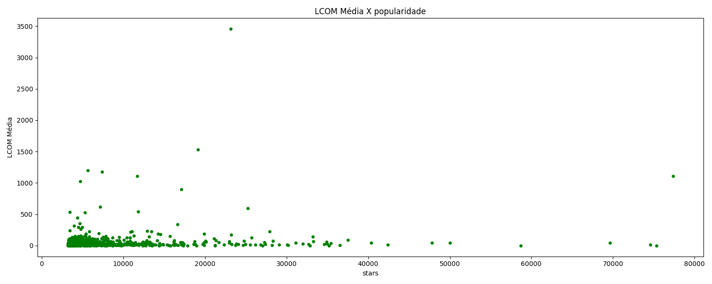
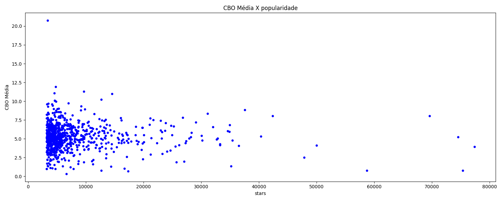
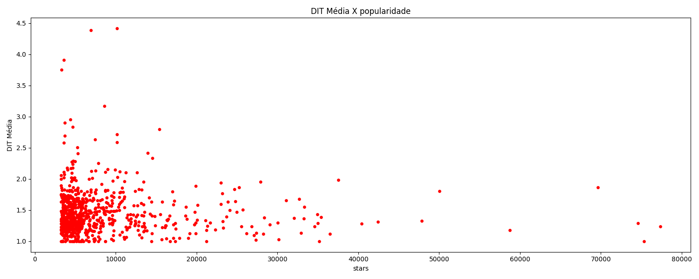
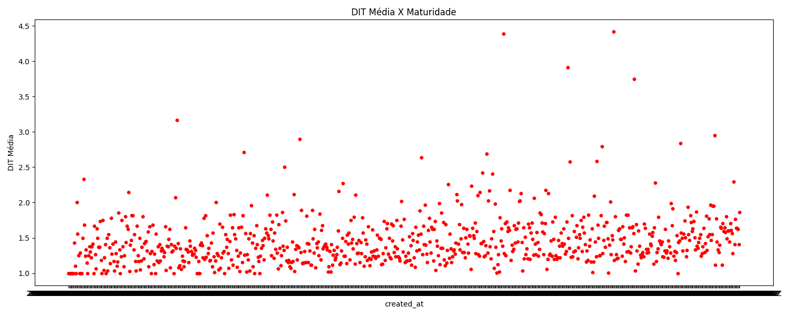
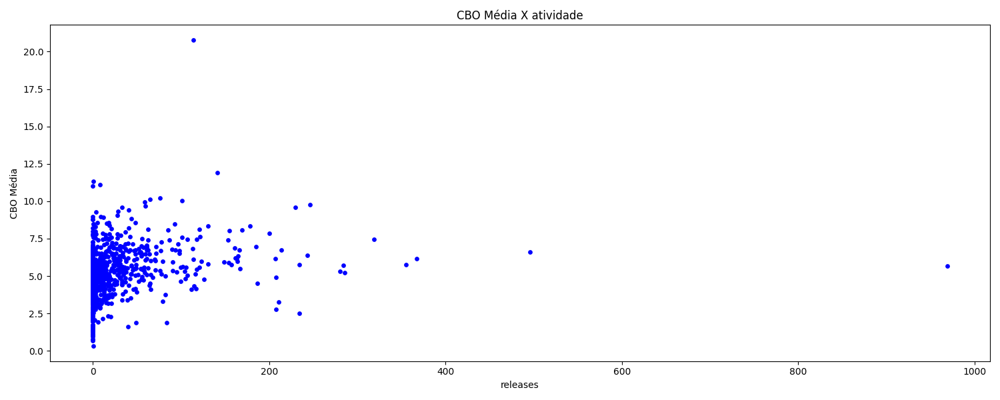
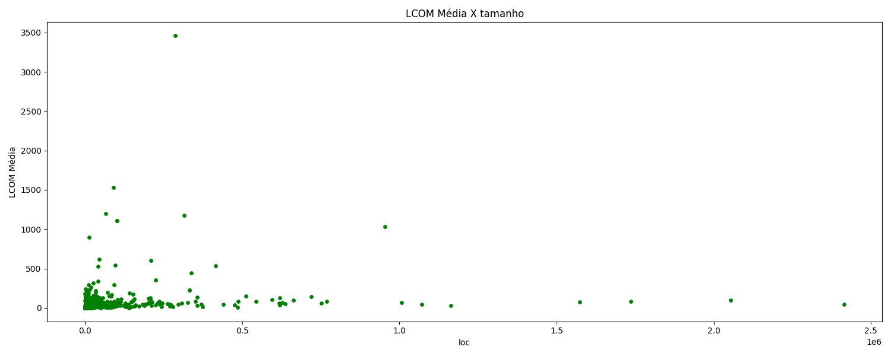
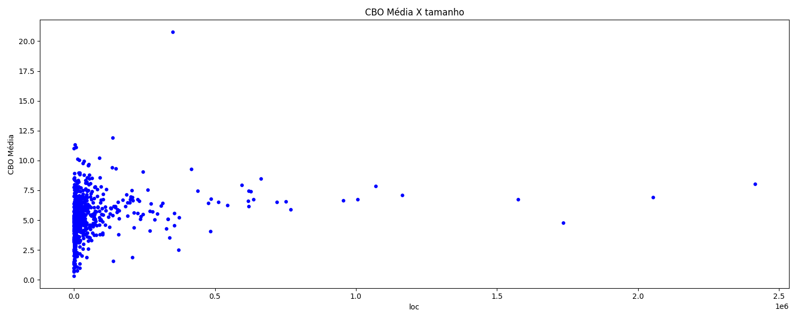

# Relatório de Análise de Qualidade de Repositórios Java

## 1. Introdução

Neste relatório, analisamos a qualidade de repositórios open-source desenvolvidos na linguagem Java, correlacionando diversas métricas de qualidade com características do processo de desenvolvimento desses repositórios. A hipótese principal é que repositórios mais populares, maduros e com maior atividade tendem a apresentar melhores atributos de qualidade interna, como menor acoplamento e maior coesão, devido à atenção mais frequente dos contribuidores e processos mais maduros de revisão e manutenção.

## 2. Metodologia

A metodologia aplicada seguiu os seguintes passos:

### 2.1. Seleção de Repositórios

Foram selecionados os 1.000 repositórios Java mais populares no GitHub. A seleção foi baseada no número de estrelas, assumindo que esse critério reflete a popularidade e a relevância dos repositórios para a comunidade.

### 2.2. Métricas de Processo

As métricas de processo analisadas incluem:

- **Popularidade**: número de estrelas no GitHub.
- **Tamanho**: linhas de código (LOC).
- **Atividade**: número de releases.
- **Maturidade**: idade (em anos) do repositório.

### 2.3. Métricas de Qualidade

Para avaliar a qualidade interna dos repositórios, utilizamos a ferramenta de análise estática CK, que gera métricas como:

- **CBO (Coupling Between Objects)**: mede o grau de acoplamento entre classes.
- **DIT (Depth Inheritance Tree)**: mede a profundidade da árvore de herança.
- **LCOM (Lack of Cohesion of Methods)**: mede a falta de coesão entre métodos de uma classe.

### 2.4. Coleta de Dados

As métricas de processo foram coletadas utilizando a API GraphQL do GitHub, enquanto as métricas de qualidade foram extraídas por meio da análise estática do repositório clonado com a ferramenta CK. O CK gera arquivos .csv que foram sumarizados para realizar as correlações com as características de processo.

## 3. Resultados

### RQ 01: Qual a relação entre a popularidade dos repositórios e suas características de qualidade?

Analisando os gráficos abaixo, vemos que, dos projetos que possuem valores disponíveis, mesmo se tornando mais famosos, não fogem muito da média da qualidade dos outros projetos menos populares.

### RQ 02: Qual a relação entre a maturidade dos repositórios e suas características de qualidade?

Analisando os gráficos abaixo, observamos que a maturidade dos repositórios não apresenta uma correlação clara com suas características de qualidade. Projetos mais antigos não necessariamente possuem melhores métricas de qualidade em termos de acoplamento, coesão e profundidade da árvore de herança.

### RQ 03: Qual a relação entre a atividade dos repositórios e suas características de qualidade?

Analisando os gráficos abaixo, podemos observar que a atividade dos repositórios, medida pelo número de releases, não apresenta uma correlação clara com suas características de qualidade. Projetos com maior número de releases não necessariamente possuem melhores métricas de qualidade.

### RQ 04: Qual a relação entre o tamanho dos repositórios e suas características de qualidade?

Repositórios maiores, como o **mall** (100.903 linhas de código), apresentam um **CBO mediano** de 3.0 e uma **LCOM média** extremamente alta (1.110,8), , porém isso não é regra. Observando o gráfico abaixo que isso é um caso isolado, e que possuímos outros repositórios maiores, mas com LCOM baixa, sendo assim, a alteração de linhas de código LOC não afeta perceptivelmente as métricas de qualidade.

## 4. Discussão

### Hipóteses

A expectativa inicial era de que repositórios mais populares e maduros apresentariam melhores atributos de qualidade interna, como menor acoplamento e maior coesão. Também esperávamos que repositórios com maior atividade (número de releases) tivessem métricas de qualidade mais otimizadas devido à manutenção e refatoração contínua. Quanto ao tamanho, a hipótese era de que projetos maiores enfrentariam desafios em manter a modularidade e coesão.

### Valores Obtidos

Os resultados obtidos a partir da coleta de dados desafiam as hipóteses. A variação das métricas de processo analisadas não mostrou correlação clara com a qualidade dos projetos.

## 5. Conclusão

Este laboratório demonstrou que a qualidade dos repositórios open-source Java pode variar consideravelmente, mesmo entre projetos populares e maduros. A maturidade, popularidade, atividade e tamanho dos repositórios não são indicadores claros de boa qualidade. As métricas de qualidade calculadas pela ferramenta CK forneceram insights valiosos, mas a falta de dados em alguns repositórios sugere a necessidade de maior cuidado na seleção e análise desses projetos.
